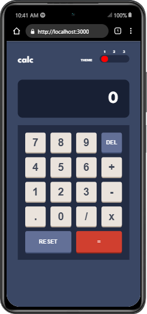

# Calculator - App


## Table of contents

- [Overview](#overview)
  - [The challenge](#the-challenge)
  - [Screenshot](#screenshot)
  - [Links](#links)
- [My process](#my-process)
  - [Built with](#built-with)
  - [What I learned](#what-i-learned)
  - [Continued development](#continued-development)
  - [Useful resources](#useful-resources)
- [Author](#author)

## Overview

This is a solution to the [Calculator app challenge on Frontend Mentor](https://www.frontendmentor.io/challenges/calculator-app-9lteq5N29). Frontend Mentor challenges help you improve your coding skills by building realistic projects.

### The challenge

Users should be able to:

- See the size of the elements adjust based on their device's screen size
- Perform mathmatical operations like addition, subtraction, multiplication, and division
- Adjust the color theme based on their preference

### Screenshot

  

### Links

- Solution URL: [Gitub](https://github.com/Amar-arruf)

## My process

### Built with

- [stateHook]()
- [react-triple-toggle](https://www.npmjs.com/package/react-triple-toggle) -
  third party packages
- [React](https://reactjs.org/) - JS library
- [Styled Components](https://styled-components.com/) - For styles

### What I learned

in developing the Calculator-App I can learn new things including State Management , install third party packages , custom components in ReactJs Applications and last but not least it is very important switching themes using styled-components.

To see how you can add code snippets, see below:

```js
import { createGlobalStyle } from "styled-components";

export const GlobalStyles = createGlobalStyle`
  body {
    background-color: ${({ theme }) => theme.body};
  }
  .box-Container {
    color: ${({ theme }) => theme.textSecondary} !important;
  }

```

```js
import { ThemeProvider } from "styled-components";
import { darkBlueTheme, lightTheme, veryDarkViolet } from "./style/theme";
import { GlobalStyles } from "./style/global";
```

```js
  return (
    <ThemeProvider
      theme={
        theme === "veryDarkBlue"
          ? darkBlueTheme
          : theme === "light"
          ? lightTheme
          : veryDarkViolet
      }
    >
      <>
        <GlobalStyles />
        <Wrapper>
        ....
```

```js
import "./screen.css";

const Screen = (props) => {
  return (
    <div className="box-Container-Screen">
      <p>{props.value}</p>
    </div>
  );
};

export default Screen;
```

### Continued development

**Calculator - App** I want to continue focusing on in future projects. These could be concepts still not completely comfortable. maybe in the future I want refine my App and looking beautifull.

### Useful resources

- [Theme Provider](https://css-tricks.com/a-dark-mode-toggle-with-react-and-themeprovider/) - This helped me for XYZ reason. I really liked this pattern and will use it going forward.
- [Calculator in react](https://www.sitepoint.com/react-tutorial-build-calculator-app/) - This is an amazing article which helped me finally understand XYZ. I'd recommend it to anyone still learning this concept.

## Author

- Github - [Amar Ma'ruf](https://github.com/Amar-arruf)
- Frontend Mentor - [@Amar-arruf](https://www.frontendmentor.io/profile/Amar-arruf)
- Facebook - [Amar Arruf](https://www.facebook.com/amar.arruf.7/)
